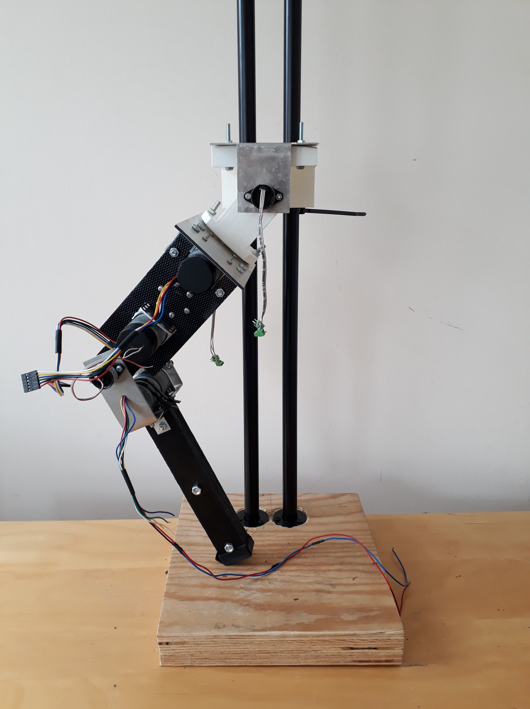

# Jumping Energy Harvester
Using the variable damping on a VSA (Variable Stiffness Actuator) can improve the 
energy efficiency, especially on a highly dynamic robots. This project aims to exploit
that effect on a vertical jumping robot based on the MACCEPA-VD (The Mechanically Adjustable Compliance and Controllable Equilibrium Position Actuator with Variable Damping)

  

 
## How to run ## 

The simulation files are written in MATLAB. To run the simulation execute the following file
./Simulations/maccepaHopperSimulation

## 3D Model ##

* The 3D CAD files with .step extension are provided in:
 /hardware/Model/STEPFiles 

* The assembled model with and without the vertical stand are given in:
 /hardware/Model/Assembled
 

  

