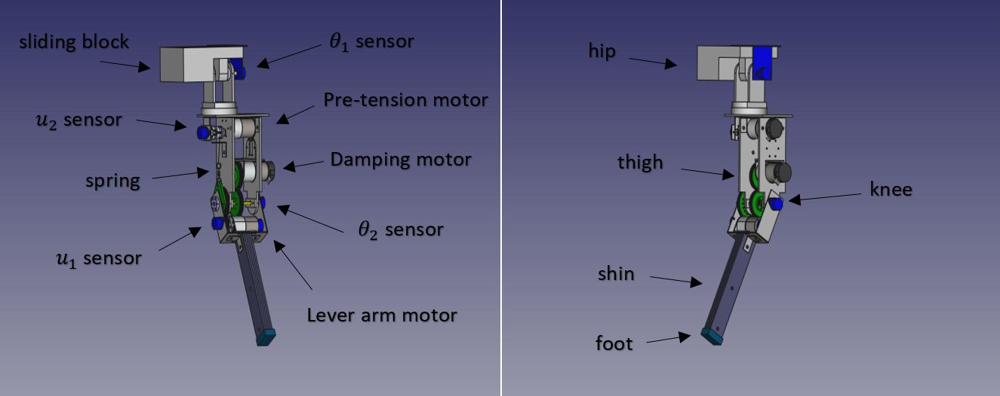

%% Description %%
Using the variable damping on a VSA (Variable Stiffness Actuator) can improve the 
energy efficiency, especially on a highly dynamic robots. This project aims to exploit
that effect on a vertical jumping robot based on the MACCEPA-VD (The Mechanically Adjustable Compliance and Controllable Equilibrium Position Actuator with Variable Damping).
 
%% How to run %% 
The simulation files are written in MATLAB. To run the simulation execute the following file
./Simulations/maccepaHopperSimulation

  

